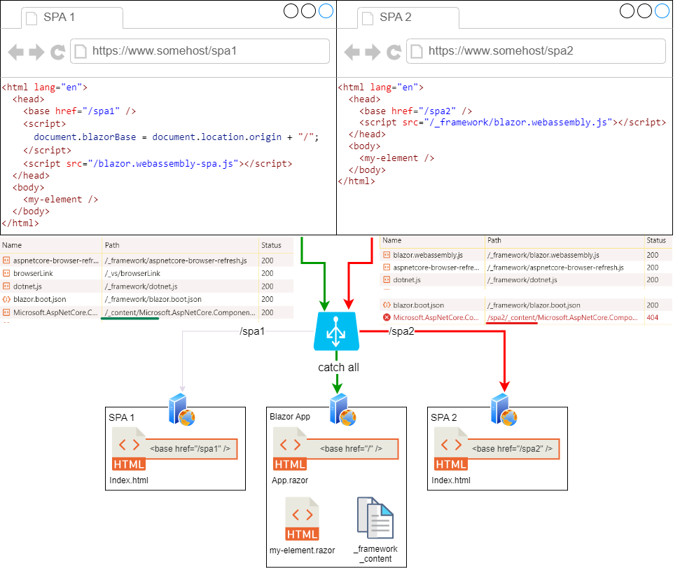

# Blazor with SPAs

This repo has Blazor WebApp and two Angular applications.  
It is created to showcase Blazor custom elements, which are as explained in the [documentation](https://learn.microsoft.com/en-us/aspnet/core/blazor/components/js-spa-frameworks?view=aspnetcore-8.0#blazor-custom-elements), "*useful for gradually introducing Razor components into existing projects written in other SPA frameworks*".  

Based on the documentation, I tried to share a Blazor custom element between multiple SPAs.

## Problem
Blazor requires the `base` tag and it's `href` to be set.
Framework files are loaded relative to the `base href`  
Angular also requires `base` tag to be set and when hosted in nested paths, in this case
`/spa1` and `/spa2`, the `base href` has to be set to these paths.  
Once the blazor is started, it's code will attempt to load rest of the required files with relative paths which results in 404. 


## Solutions
### Host Blazor App With SPAs
We could publish Blazor App and copy it to the each SPA folder/server.
This means that we have to touch both SPA subfolders/servers when ever Blazor App is modified even if the SPAs are not modified.

### Url Rewrites
Next possible solution would be to do url rewrites.
For example if using YARP as a reverse proxy you could use URL rewriting middleware.
Read more when to use URL rewriting middleware and when to use it (or not) [here](https://learn.microsoft.com/en-us/aspnet/core/fundamentals/url-rewriting/#when-to-use-url-rewriting-middleware)  

### Configure Blazor Client Side
URL rewriting is working but it would be nice (and avoid extra server side processing) if the Blazor supports the client side configuration that allows configuring the base path for fetching the required files.
I've was able to achieve this by modifying the *blazor.webassembly.js* and using the modified version in the SPAs index.html.
The only change in the js file was to search for `document.baseURI` and replace it with `(document.blazorBase || document.baseURI)` 
The `blazorBase` is set in the SPA's [index.html](/apps/spa1/src/index.html#L21) before [loading](/apps/spa1/src/index.html#L23) the modified *blazor.webassembly-spa.js* that is hosted in the BlazorApp [wwwroot](BlazorApp/BlazorApp/wwwroot).  
With this tweak applied we got SPA1 working  


## Conclusion

Although documentation suggests that Blazor is "*useful for gradually introducing Razor components into existing projects written in other SPA frameworks*", beside sample code with "happy path" of including it in the single SPA it does not help much to actually achieve this.  
Also I think that configuration on the client side would be beneficial and allow low friction integration of Blazor components with the exiting SPAs without need for changes to the hosting, deployment, and code for SPAs nor for Blazor app that hosts the shared components.

Adding configuration similar to this, would fix the issues with Blazor framework loading from different sub-applications (/spa1,/spa2) 

```html
<html lang="en">
  <head>
    <base href="/spa1" />
    <script src="/blazor.webassembly.js" autostart="false"></script> 
    <script>
      Blazor.start({
        blazorBase: "/"
      });
    </script>
  </head>
  <body>
    <my-element />
  </body>
</html>
```

## Try it out

### Requirements
* .net 8  
* node 18.x or greater

### Run The App
Open the `BlazorApp.sln` and start the `BlazorApp`.   
The `BlazorApp.csproj` has an [msbuild target named BuildSpa](BlazorApp/BlazorApp/BlazorApp.csproj#L14) which is run before every build and does the following:
* restores the npm packages
* builds angular applications
* copies the generated SPAs to BlazorApp's wwwroot folder

Because of this, the first run takes some time.

Without tweaks, SPAs will not show the blazor custom element because of the problem mentioned above.  


In order for SPAs to show the custom element the [index.html](/apps/spa1/src/index.html#L21) should be modified.
After modifying the SPAs make sure to rebuild solution so it picks the SPA files.
The custom Blazor element should now be visible.  

